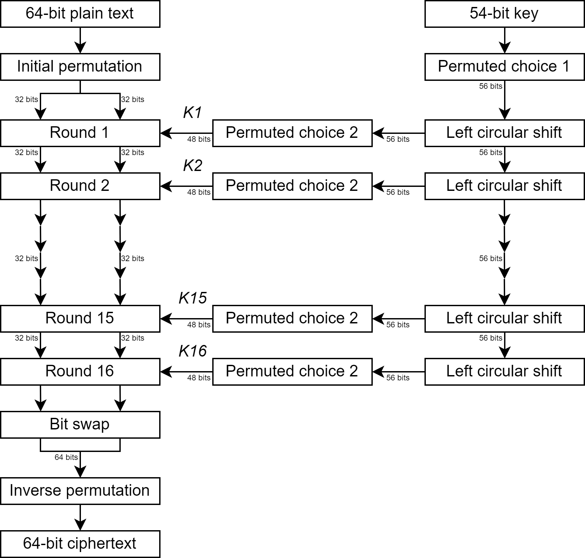
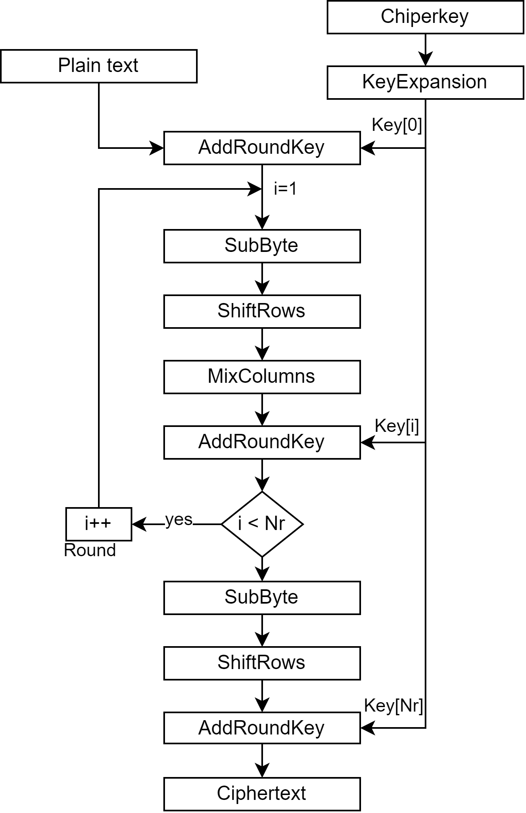

.. _Chapter_3:

==========
Background
==========
------------------------
Cryptographic Algorithms
------------------------

Data Encryption Standard (DES) Algorithm
~~~~~~~~~~~~~~~~~~~~~~~~~~~~~~~~~~~~~~~~

The DES is a symmetric-key block cipher encryption algorithm used to secure data. It was developed in the 1970s by IBM and later adopted as a federal standard for encryption in the U.S. DES operates on fixed-size blocks of data, typically 64 bits, and uses a 56-bit secret key for encryption and decryption.

**Key Generation:**

- The 56-bit secret key is used to generate 16 subkeys, each 48 bits long, for the encryption rounds.

**Initial Permutation:**

- The 64-bit plaintext undergoes an initial permutation to shuffle the bits according to a predefined permutation table.

**Feistel Network:**

- The 64-bit plaintext is divided into two 32-bit blocks: Left (L0) and Right (R0).
- The Right block is expanded to 48 bits to match the size of the subkey.
- The result is XORed with the subkey for the current round.

**Substitution (S-Boxes):**

- The 48-bit result is divided into 8 6-bit blocks, used as indices for eight S-Boxes.
- S-Boxes replace 6 bits with 4 bits using predefined tables.

**Permutation:**

- The 32-bit output from the S-Boxes undergoes another permutation using a predefined table.

**Rounds:**

- DES consists of 16 rounds of processing, with data alternately swapped and processed.
- In each round, the right half becomes the new left half, and the result from the Feistel network is XORed with the original left half.

**Final Permutation and Output:**

- After the final round, the left and right halves are combined, and a final permutation is applied to produce the 64-bit ciphertext.

**Decryption:**

- Decryption is essentially the reverse of encryption, using the same subkeys in reverse order.
- After the final round, the initial permutation is applied to obtain the original plaintext.

It's important to note that DES, although historically significant, is no longer considered secure against modern cryptographic attacks. The 56-bit key length has been shown to be vulnerable to brute force attacks. As a result, DES has been largely replaced by more secure encryption algorithms, such as the Advanced Encryption Standard (AES).

   Fig. 3.1: Flow Diagram of DES algorithm for encrypting data.

Advanced Encryption Standard
~~~~~~~~~~~~~~~~~~~~~~~~~~~~

The AES is a widely used symmetric-key encryption algorithm designed to secure data. It was established as a standard by the U.S. National Institute of Standards and Technology (NIST) in 2001 to replace the old DES. AES is notable for its security, efficiency, and versatility.

AES operates on fixed-size blocks of data, with three standard key sizes: 128-bit, 192-bit, and 256-bit. It uses a substitution-permutation network (SPN) structure to encrypt and decrypt data.

**Key Expansion:**

- The user provides a secret key, which is used to generate a set of round keys.
- Key expansion uses a key schedule algorithm that creates a set of round keys for each encryption round. The number of rounds depends on the key size: 10 rounds for 128-bit keys, 12 rounds for 192-bit keys, and 14 rounds for 256-bit keys.

**Initial Round Key Addition:**

- In the first round, the plaintext is XORed with the initial round key.

**Rounds:**

- AES processes data in multiple rounds, with the number of rounds determined by the key size.
- Each round consists of four main transformations:

	1. *SubBytes*: This step replaces each byte of the state with a corresponding byte from the S-Box, a predefined substitution box.

	2. *ShiftRows*: Bytes within each row of the state are shifted to the left, creating diffusion in the data.

	3. *MixColumns*: Columns of the state are mixed using a mathematical transformation.

	4. *Round Key Addition*: The round key for the current round is XORed with the state.

**Final Round:**

- The final round does not include the MixColumns transformation.

**Output:**

- The processed data, after all rounds, produces the ciphertext.

**Decryption:**

- Decryption in AES is essentially the reverse of encryption. The ciphertext is processed through the inverse of the encryption operations using the same round keys in reverse order.

**Security:**

- AES is highly secure due to its key sizes and the complexity of its operations. It is resistant to known cryptographic attacks, including differential and linear cryptanalysis.

**Versatility:**

- AES is suitable for various applications, including data encryption, secure communications, and securing data at rest. It is widely used in applications such as secure communications over the internet (HTTPS), encryption of data stored on disk drives, and more.

   Fig. 3.2: Flow Diagram of AES algorithm for encrypting data.

---------------------
Large Language Models
---------------------

Large Language Models, often abbreviated as LLMs, are a category of artificial intelligence models that are specifically designed to understand, generate, and manipulate human language. These models are constructed using deep learning techniques, typically based on neural networks, and they are trained on vast amounts of text data from the internet, books, articles, and other sources. The training process enables them to learn the patterns, syntax, and semantics of human language.

LLMs have gained immense popularity and importance due to their capabilities in natural language understanding and generation. They serve as the foundation for a wide range of applications in various fields, including natural language processing (NLP), machine translation, chatbots, content generation, and more.

The most popular LLMs as of 2023 include:

- **GPT-4 by OpenAI**: Released in March 2023, GPT-4 has showcased tremendous capabilities with complex reasoning understanding, advanced coding capability, proficiency in multiple academic exams, skills that exhibit human-level performance, and much more. It’s the first multimodal model that can accept both texts and images as input. GPT-4 is one of the very few LLMs that has addressed hallucination and improved factuality by a mile.

- **GPT-3.5 Turbo** by OpenAI: This model allows developers to describe functions to the models, which can then output a JSON object containing arguments to call those functions. It enables interactive and detailed conversations with the model, making it valuable for various applications.

- **Codex by OpenAI**: Launched in partnership with GitHub for Github Copilot, Codex is proficient in more than a dozen programming languages. It can interpret simple commands in natural language and execute them on the user’s behalf.

- Other notable LLMs include **BARD**, **Cohere**, **PaLM**, and **Claude v1**. These models excel in tasks such as text generation, language translation, crafting creative content, answering queries, and code generation.

How LLMs Are Used Nowadays:
~~~~~~~~~~~~~~~~~~~~~~~~~~~~

1. **Natural Language Processing (NLP):** LLMs play a pivotal role in NLP tasks such as sentiment analysis, text classification, named entity recognition, and text summarization. They empower computers to engage with and analyze human language at a profound level.

2. **Machine Translation:** LLMs are instrumental in machine translation services, enabling the accurate and rapid translation of text between languages. Prominent services like Google Translate heavily rely on LLMs.

3. **Chatbots and Virtual Assistants:** LLMs are the driving force behind the creation of intelligent chatbots and virtual assistants capable of engaging in human-like conversations and providing assistance in a wide array of applications, from customer support to information retrieval.

4. **Content Generation:** LLMs are used for the automatic generation of content for websites, social media, and marketing materials. They can produce text that emulates human writing styles and are valuable for auto-generating reports, articles, and more.

5. **Search Engines:** Search engines harness the capabilities of LLMs to enhance the quality of search results, better comprehend user queries, and provide more pertinent information.

6. **Conversational AI:** LLMs are integral to the construction of conversational AI systems, supporting automated customer support, virtual influencers, and interactive storytelling.

7. **Language Translation and Understanding:** LLMs have made substantial advancements in the understanding of context and linguistic nuances, a vital component for numerous applications that involve cross-lingual communication and comprehension.

8. **Research and Scientific Discoveries:** Researchers employ LLMs to process and analyze extensive text data, potentially leading to insights and discoveries across various domains, including medicine, social sciences, and more.

The field of LLMs continues to evolve, and newer models and applications may have emerged. The utilization of LLMs is expected to expand further, given their capacity to understand and generate human language, solidifying their status as a cornerstone of contemporary artificial intelligence and natural language processing.

LLM ethical guidelines and legal constraints
~~~~~~~~~~~~~~~~~~~~~~~~~~~~~~~~~~~~~~~~~~~~

The most popular LLMs are bound by ethical guidelines and legal constraints. These restrictions are in place to ensure responsible and ethical use of the technology and to comply with the law. Some key limitations and reasons why large language models cannot answer all questions or engage in discussions related to illegal activities:

- **Ethical Guidelines**: Like OpenAI and other popular LLMs, the organizations behind those models have established ethical guidelines to ensure that the technology is used for beneficial and responsible purposes. Engaging in discussions or providing information about illegal activities goes against these guidelines.

- **Legal Constraints**: Providing assistance or information related to illegal activities is against the law in many jurisdictions. This includes discussions about activities such as drug trafficking, terrorism, child exploitation, hacking, and other criminal acts. Language models must

----------------------
Hardware Vulnerability
----------------------

Trojan Hardware
~~~~~~~~~~~~~~~

A Trojan hardware is a malicious modification or addition to the design, manufacturing, or supply chain of Integrated Circuits (ICs), Printed Circuit Boards (PCBs), or other electronic components. These alterations are made with the intent of compromising the security or functionality of the target device. Trojan hardware is a form of hardware-based cyberattack and is a serious threat to the integrity and security of electronic systems.

Some key points about Trojan hardware:

- **Insertion Points**: Trojan hardware can be inserted at various stages of the supply chain, from the design phase to manufacturing, assembly, and distribution. This makes it challenging to detect and mitigate.

- **Malicious Functions**: Hardware Trojans can have various malicious functions, such as creating hidden backdoors for unauthorized access, leaking sensitive data, disrupting the device's operation, or facilitating attacks on other components or systems.

- **Motivations**: These Trojans can be inserted for various reasons, including industrial espionage, intellectual property theft, sabotage, or cyberwarfare. State-sponsored actors and criminal organizations often use hardware Trojans for their objectives.

- **Detection and Mitigation**: Detecting hardware Trojans is a complex and challenging task. It may involve extensive testing, reverse engineering, or advanced scanning techniques to identify inconsistencies or malicious components. Ensuring the integrity of the supply chain and implementing security practices at each stage is crucial to mitigating the risks associated with hardware Trojans.

Backdoor
~~~~~~~~

A backdoor, in the context of computer security, is a hidden or unauthorized means of accessing a computer system, network, or software application. It allows an attacker to bypass normal authentication mechanisms and gain unauthorized access. Backdoors can take various forms, such as software-based backdoors or hardware-based backdoors. They are typically used for remote control or covert access to a system for malicious purposes.

Some key points about backdoors:

- **Remote Access**: Backdoors are often designed to provide remote access to a system without the knowledge or consent of the system's legitimate users. This can be achieved through network connections or other communication channels.

- **Legitimate and Illegitimate Uses**: While some backdoors are created for legitimate purposes, such as system administration and troubleshooting, malicious backdoors are intentionally designed to compromise security. These malicious backdoors are the ones of concern in cybersecurity.

- **Types of Backdoors**: Backdoors can be software-based, integrated into the code of an application or operating system, or hardware-based, built into the hardware components or systems. They can also be password-protected, encrypted, or obfuscated to avoid detection.

- **Mitigation and Detection**: Detecting and mitigating backdoors is a challenging task. Security measures include using intrusion detection systems, penetration testing, access controls, regular security audits, and ensuring that software and hardware components come from trusted sources.

