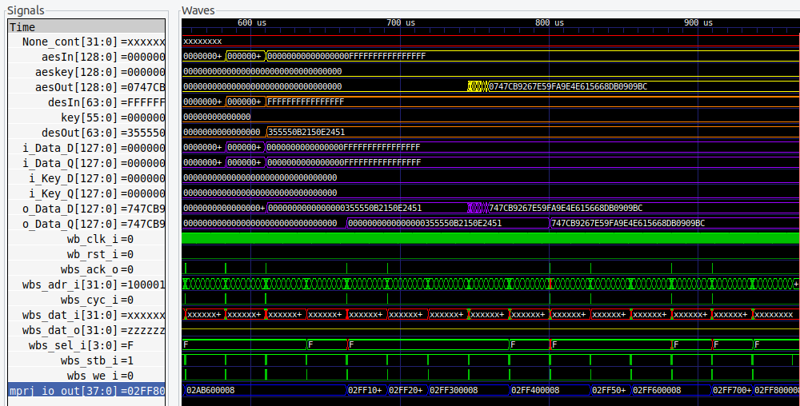
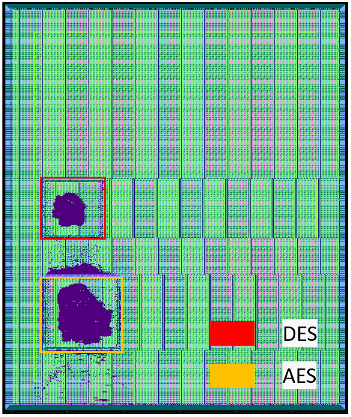
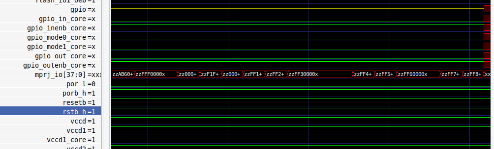
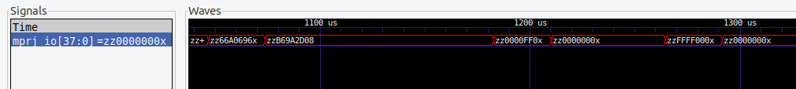
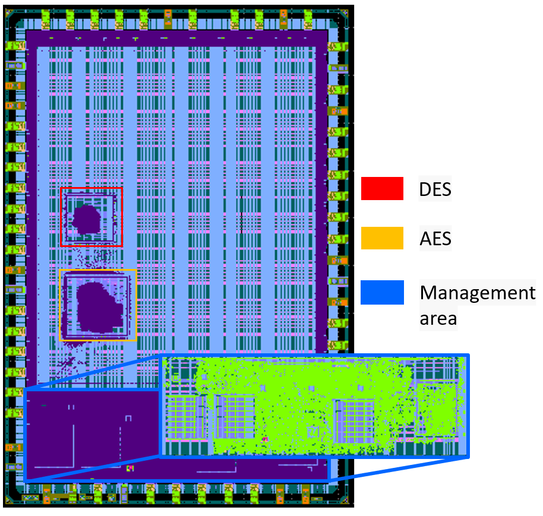

.. _Chapter_6:

===================
Caravel Integration
===================

For seamless integration of the AES_Trojan and DES_Trojan with Caravel, the preferred method is to employ the Wishbone interface. Three registers have been developed to facilitate this integration: 

1. **Data Register**: This register stores the data that is to be encrypted, with addresses ranging from 0x3000_0000 to 0x3000_000C.

2. **Key Register**: The Key Register holds the encryption key to be used, with addresses spanning from 0x3000_0010 to 0x3000_001C.

3. **Output Register**: The Output Register is responsible for storing the final output once the encryption algorithm has completed, and its addresses fall within the range of 0x3000_0020 to 0x3000_002C.

Given that Caravel's Wishbone interface operates with 32-bit data, each register is associated with 4 consecutive addresses.

To manage the multiplexers, initiate encryption, and make decisions regarding encryption or decryption, specific signals from the logic analyzer are employed:

- **la_data_in[0]**: This signal is utilized as a multiplexer selector, with the value 0 representing DES and 1 representing AES.

- **la_data_in[1]**: It serves as the encryption/decryption selector for DES, where 0 indicates encryption and 1 signifies decryption.

- **la_data_in[2]**: This signal is used to initiate the DES encryption process.

- **la_data_out[3]**: It indicates the completion of the DES encryption.

- **la_data_in[4]**: This signal acts as the encryption/decryption selector for DES, with 0 denoting encryption and 1 representing decryption.

- **la_data_in[5]**: This signal initiates the DES encryption process.

- **la_data_out[6]**: It signals the completion of the DES encryption.

These signals play a critical role in managing the encryption and decryption processes and ensuring that the Trojans are integrated effectively with the Caravel platform.

Fig. 7.1 illustrates the connection between the Caravel platform and the crypto modules.

.. figure:: images/Caravel_Diagram.png
   :scale: 8%
   :align: center
      
   Fig. 7.1: Caravel Block Diagram.
   
----------------------------  
Running Full Chip Simulation
----------------------------

You can locate the `user_project_wrapper` Verilog file with the specified modifications in the directory path: ``verilog/rtl/user_project_wrapper.v``. For a comprehensive testbench of the Caravel system, Caravel provides a convenient and straightforward method to achieve this.

First, you will need to install the simulation environment, by

.. code:: bash

    make simenv

This will pull a docker image with the needed tools installed.

Then, run the RTL simulation by

.. code:: bash

    export PDK_ROOT=<pdk-installation-path>
    make verify-<testbench-name>-rtl
    
    # For example
    make verify-io_ports-rtl

Once you have the physical implementation done and you have the gate-level netlists ready, it is crucial to run full gate-level simulations to make sure that your design works as intended after running the physical implementation. 

Run the gate-level simulation by: 

.. code:: bash

    export PDK_ROOT=<pdk-installation-path>
    make verify-<testbench-name>-gl

    # For example
    make verify-io_ports-gl
    
Simulation
~~~~~~~~~~

To ensure accurate simulation, it is essential to create the C++ code that the RISC-V processor will use. The following code was utilized for this simulation:

.. code:: C

   // This include is relative to $CARAVEL_PATH (see Makefile)
   #include <defs.h>
   #include <stub.c>

   /*
   	Wishbone Test:
   		- Configures MPRJ lower 8-IO pins as outputs
   		- Checks counter value through the wishbone port
   */

   #define i_Key_ADDR_0   (*(volatile uint32_t*)0x30000000)
   #define i_Key_ADDR_1   (*(volatile uint32_t*)0x30000004)
   #define i_Key_ADDR_2   (*(volatile uint32_t*)0x30000008)
   #define i_Key_ADDR_3   (*(volatile uint32_t*)0x3000000C)
   #define i_Data_ADDR_0   (*(volatile uint32_t*)0x30000010)
   #define i_Data_ADDR_1   (*(volatile uint32_t*)0x30000014)
   #define i_Data_ADDR_2   (*(volatile uint32_t*)0x30000018)
   #define i_Data_ADDR_3   (*(volatile uint32_t*)0x3000001C)
   #define o_Data_ADDR_0   (*(volatile uint32_t*)0x30000020)
   #define o_Data_ADDR_1   (*(volatile uint32_t*)0x30000024)
   #define o_Data_ADDR_2   (*(volatile uint32_t*)0x30000028)
   #define o_Data_ADDR_3   (*(volatile uint32_t*)0x3000002C)

   void main()
   {

	/* 
	IO Control Registers
	| DM     | VTRIP | SLOW  | AN_POL | AN_SEL | AN_EN | MOD_SEL | INP_DIS | HOLDH | OEB_N | MGMT_EN |
	| 3-bits | 1-bit | 1-bit | 1-bit  | 1-bit  | 1-bit | 1-bit   | 1-bit   | 1-bit | 1-bit | 1-bit   |
	Output: 0000_0110_0000_1110  (0x1808) = GPIO_MODE_USER_STD_OUTPUT
	| DM     | VTRIP | SLOW  | AN_POL | AN_SEL | AN_EN | MOD_SEL | INP_DIS | HOLDH | OEB_N | MGMT_EN |
	| 110    | 0     | 0     | 0      | 0      | 0     | 0       | 1       | 0     | 0     | 0       |
	
	 
	Input: 0000_0001_0000_1111 (0x0402) = GPIO_MODE_USER_STD_INPUT_NOPULL
	| DM     | VTRIP | SLOW  | AN_POL | AN_SEL | AN_EN | MOD_SEL | INP_DIS | HOLDH | OEB_N | MGMT_EN |
	| 001    | 0     | 0     | 0      | 0      | 0     | 0       | 0       | 0     | 1     | 0       |
	*/

	/* Set up the housekeeping SPI to be connected internally so	*/
	/* that external pin changes don't affect it.			*/
	

    reg_spi_enable = 1;
    reg_wb_enable = 1;
	// reg_spimaster_config = 0xa002;	// Enable, prescaler = 2,
                                        // connect to housekeeping SPI

	// Connect the housekeeping SPI to the SPI master
	// so that the CSB line is not left floating.  This allows
	// all of the GPIO pins to be used for user functions.

    reg_mprj_io_31 = GPIO_MODE_MGMT_STD_OUTPUT;
    reg_mprj_io_30 = GPIO_MODE_MGMT_STD_OUTPUT;
    reg_mprj_io_29 = GPIO_MODE_MGMT_STD_OUTPUT;
    reg_mprj_io_28 = GPIO_MODE_MGMT_STD_OUTPUT;
    reg_mprj_io_27 = GPIO_MODE_MGMT_STD_OUTPUT;
    reg_mprj_io_26 = GPIO_MODE_MGMT_STD_OUTPUT;
    reg_mprj_io_25 = GPIO_MODE_MGMT_STD_OUTPUT;
    reg_mprj_io_24 = GPIO_MODE_MGMT_STD_OUTPUT;
    reg_mprj_io_23 = GPIO_MODE_MGMT_STD_OUTPUT;
    reg_mprj_io_22 = GPIO_MODE_MGMT_STD_OUTPUT;
    reg_mprj_io_21 = GPIO_MODE_MGMT_STD_OUTPUT;
    reg_mprj_io_20 = GPIO_MODE_MGMT_STD_OUTPUT;
    reg_mprj_io_19 = GPIO_MODE_MGMT_STD_OUTPUT;
    reg_mprj_io_18 = GPIO_MODE_MGMT_STD_OUTPUT;
    reg_mprj_io_17 = GPIO_MODE_MGMT_STD_OUTPUT;
    reg_mprj_io_16 = GPIO_MODE_MGMT_STD_OUTPUT;

     /* Apply configuration */
    reg_mprj_xfer = 1;
    while (reg_mprj_xfer == 1);
    
	//LA 0 = inputs to the cpu, 1 outputs from the cpu
	reg_la0_oenb = reg_la0_iena = 0x00000037;    // LA[3:0] = 0111; & LA[7:4] = 0011;

	// Flag start of the test
	reg_mprj_datal = 0xAB600000;

	// Key init values
	i_Key_ADDR_0 = 0x00000000;
	i_Key_ADDR_1 = 0x00000000; // kEY = 0x000000000000FFFF
	// Data init values
	i_Data_ADDR_0 = 0xFFFFFFFF;
	i_Data_ADDR_1 = 0xFFFFFFFF; // DATA = 0x00000000FFFFFFFF	
	

	reg_la0_data = 0x00000004; //start=1,decrypt=0,Mux=DES(0)
	reg_la0_data = 0x00000000; //start=0
	while ((reg_la0_data_in && 0x00000008)  == 1); //Wait for the finish signal
	reg_mprj_datal = 0xff100000;		 //Control flag
	while ((o_Data_ADDR_0 == 0x150E2451)); //If the encryption is correct, it can continue
	reg_mprj_datal = 0xff200000;		 //Control flag
	while ((o_Data_ADDR_1 == 0x355550B2)); //If the encryption is correct, it can continue
	reg_mprj_datal = 0xff300000;		 //Control flag
	
	reg_la0_data = 0x00000021; //start=1,decrypt=0,Mux=AES(1)
	reg_la0_data = 0x00000001; //start=0
	
	while ((reg_la0_data_in && 0x00000040)  == 1); //Wait for the finish signal of AES
	reg_mprj_datal = 0xff400000;		 //Control flag
	while ((o_Data_ADDR_0 == 0xdb0909bc)); //If the encryption is correct, it can continue
	reg_mprj_datal = 0xff500000;		 //Control flag
	while ((o_Data_ADDR_1 == 0x4e615668)); //If the encryption is correct, it can continue
	reg_mprj_datal = 0xff600000;		 //Control flag
	while ((o_Data_ADDR_2 == 0x7e59fa9e)); //If the encryption is correct, it can continue
	reg_mprj_datal = 0xff700000;		 //Control flag
	while ((o_Data_ADDR_3 == 0x747cb926)); //If the encryption is correct, it can continue
	reg_mprj_datal = 0xff800000;		 //Control flag
   }
  
You can find detailed information regarding the testbench in the "wb_port" folder located at ``verilog/dv/wb_port``. 

To execute the testbench run:

.. code:: bash

    make verify-wb_port-rtl
    
    
    
Following the execution of the testbench, you will discover the wave simulation, typically saved in a VCD file format. This VCD file can be found within the ``verilog/dv/wb_port`` folder, Fig. 7.2 show the User_Project_Wrapper signals. 

      
   Fig. 7.2: As shown in the image, color-coded signals enhance visualization: Yellow represents AES I/O, Orange depicts DES I/O, Purple indicates Data/Key/Output registers, Green signifies Wishbone signals, and Red marks GPIO ports.
   
Notice the alignment of GPIO ports with values provided by the RISC-V processor when encryption matches the expected encrypted value. This synchronization demonstrates the correct functioning of the encryption process.
   
--------------------------------- 
Adding your design to the wrapper
---------------------------------

After building your design you can add it to ``user_project_wrapper``, which takes the ``.gds`` and ``.lef`` files you produced by building your design. To achieve this, we need to adjust a few configuration options in ``user_project_wrapper/config.tcl``:

.. code-block:: tcl

   {
    "DESIGN_NAME": "user_project_wrapper",
    "VERILOG_FILES": [
        "dir::../../verilog/rtl/defines.v",
        "dir::../../verilog/rtl/user_project_wrapper.v"
    ],
    "ROUTING_CORES": 24,
    "CLOCK_PERIOD": 25,
    "CLOCK_PORT": "wb_clk_i",
    "//CLOCK_NET": ["aes_Trojan.clk","des_Trojan.clk"],
    "FP_PDN_MACRO_HOOKS": "des_Trojan vccd1 vssd1 vccd1 vssd1, aes_Trojan vccd1 vssd1 vccd1 vssd1",
    "MACRO_PLACEMENT_CFG": "dir::macro.cfg",
    "VERILOG_FILES_BLACKBOX": [
        "dir::../../verilog/rtl/AES_Trojan/*.v",
         "dir::../../verilog/rtl/DES_Trojan/*.v"
    ],

    "EXTRA_LEFS": ["dir::../../lef/aes_Trojan.lef","dir::../../lef/des_Trojan.lef"],
    "EXTRA_GDS_FILES": ["dir::../../gds/aes_Trojan.gds","dir::../../gds/des_Trojan.gds"],
    "EXTRA_LIBS": ["dir::../../lib/aes_Trojan.lib","dir::../../lib/des_Trojan.lib"],
    "//EXTRA_SPEFS": [
        "user_proj_example", 
        "dir::../../spef/multicorner/user_proj_example.min.spef", 
        "dir::../../spef/multicorner/user_proj_example.nom.spef", 
        "dir::../../spef/multicorner/user_proj_example.max.spef"
    ],
    "BASE_SDC_FILE": "dir::base_user_project_wrapper.sdc",
    "RUN_LINTER": 0,
    "QUIT_ON_SYNTH_CHECKS": 0,
    "IO_SYNC":0,
    "FP_PDN_VPITCH": 180,
    "FP_PDN_HPITCH": 180,

    "FP_PDN_VOFFSET": 5,
    "FP_PDN_HOFFSET": 5,

    "FP_SIZING": "absolute",
    "SYNTH_USE_PG_PINS_DEFINES": "USE_POWER_PINS",
    "VDD_NETS": [
        "vccd1",
        "vccd2",
        "vdda1",
        "vdda2"
    ],
    "GND_NETS": [
        "vssd1",
        "vssd2",
        "vssa1",
        "vssa2"
    ],  
    "FP_PDN_VPITCH": 180,
    "FP_PDN_HPITCH": 180,
    "FP_PDN_VOFFSET": 5,
    "FP_PDN_HOFFSET": 5,
    "UNIT": 2.4,
    "FP_IO_VEXTEND": "expr::2 * $UNIT",
    "FP_IO_HEXTEND": "expr::2 * $UNIT",
    "FP_IO_VLENGTH": "expr::$UNIT",
    "FP_IO_HLENGTH": "expr::$UNIT",
    "FP_IO_VTHICKNESS_MULT": 4,
    "FP_IO_HTHICKNESS_MULT": 4,
    "FP_PDN_CORE_RING": 1,
    "FP_PDN_CORE_RING_VWIDTH": 3.1,
    "FP_PDN_CORE_RING_HWIDTH": 3.1,
    "FP_PDN_CORE_RING_VOFFSET": 12.45,
    "FP_PDN_CORE_RING_HOFFSET": 12.45,
    "FP_PDN_CORE_RING_VSPACING": 1.7,
    "FP_PDN_CORE_RING_HSPACING": 1.7,
    "FP_PDN_VWIDTH": 3.1,
    "FP_PDN_HWIDTH": 3.1,
    "FP_PDN_VSPACING": "expr::(5 * $FP_PDN_CORE_RING_VWIDTH)",
    "FP_PDN_HSPACING": "expr::(5 * $FP_PDN_CORE_RING_HWIDTH)",
    
    
    "pdk::sky130*": {
        "RT_MAX_LAYER": "met4",
        "DIE_AREA": "0 0 2920 3520",
        "FP_DEF_TEMPLATE": "dir::fixed_dont_change/user_project_wrapper.def",
        "scl::sky130_fd_sc_hd": {
            "CLOCK_PERIOD": 25
        },
        "scl::sky130_fd_sc_hdll": {
            "CLOCK_PERIOD": 10
        },
        "scl::sky130_fd_sc_hs": {
            "CLOCK_PERIOD": 8
        },
        "scl::sky130_fd_sc_ls": {
            "CLOCK_PERIOD": 10,
            "SYNTH_MAX_FANOUT": 5
        },
        "scl::sky130_fd_sc_ms": {
            "CLOCK_PERIOD": 10
        }
    },
    "pdk::gf180mcuC": {
        "STD_CELL_LIBRARY": "gf180mcu_fd_sc_mcu7t5v0",
        "FP_PDN_CHECK_NODES": 0,
        "FP_PDN_ENABLE_RAILS": 0,
        "RT_MAX_LAYER": "Metal4",
        "DIE_AREA": "0 0 3000 3000",
        "FP_DEF_TEMPLATE": "dir::fixed_dont_change/user_project_wrapper_gf180mcu.def",
        "PL_OPENPHYSYN_OPTIMIZATIONS": 0,
        "DIODE_INSERTION_STRATEGY": 0,
        "MAGIC_WRITE_FULL_LEF": 0
    }
   }

Placement macro
~~~~~~~~~~~~~~~

If your design is different in size to the example you should adjust the position, where your module will be placed inside the wrapper. This can be done in ``user_project_wrapper/macro.cfg``:

.. code-block:: tcl

   aes_Trojan 300 500 N
   des_Trojan 300 1500 N

In this case 300/500 specify the X/Y position of the aes_Trojan macro. The size of the wrapper can be found in ``user_project_wrapper/config.tcl``, with that and the size of your design you can figure out, where you need to place your design.

Building the wrapper
~~~~~~~~~~~~~~~~~~~~

After modifying the configuration files of the wrapper you can build it to produce a wrapper, which contains your design:

.. code-block:: bash

   make user_project_wrapper

Upon executing the previous command, provided everything is functioning as expected, you should encounter the message "[SUCCESS]: Flow complete". In such a case, navigate to the directory ``openlane/user_project_wrapper/runs/<Execution_Date>``. Inside this directory, you will locate the folder containing the comprehensive reports and files generated by OpenLane. Among these files, you'll find the GDSII file, which is visually represented in Fig. 7.3, displaying the GDS representation.

   Fig. 7.3: GDSII file of the user_project_wrapper.
   
   
Running Gate-Level Full Chip Simulation
~~~~~~~~~~~~~~~~~~~~~~~~~~~~~~~~~~~~~~~

To execute the gate-level testbench run:

.. code:: bash

    make verify-wb_port-gl
    
Since the gate-level simulation employs Verilog files with SKY130 standard cells, it does not allow for the visualization of internal signals. However, the module's correct operation is confirmed by the activation of GPIO ports when it produces the expected encryption value. This activation is a crucial indicator, as it signifies the successful termination of the while loops, as described in the provided C code.

      
   Fig. 7.4: Caravel gate-level testbench.
   
   
Trojan insertion testbench
~~~~~~~~~~~~~~~~~~~~~~~~~~

The C code has been modified to initialize the Trojan. The new C code is presented below.

.. code:: C

   // This include is relative to $CARAVEL_PATH (see Makefile)
	#include <defs.h>
	#include <stub.c>

	/*
		Wishbone Test:
			- Configures MPRJ lower 8-IO pins as outputs
			- Checks counter value through the wishbone port
	*/

	#define i_Key_ADDR_0   (*(volatile uint32_t*)0x30000000)
	#define i_Key_ADDR_1   (*(volatile uint32_t*)0x30000004)
	#define i_Key_ADDR_2   (*(volatile uint32_t*)0x30000008)
	#define i_Key_ADDR_3   (*(volatile uint32_t*)0x3000000C)
	#define i_Data_ADDR_0   (*(volatile uint32_t*)0x30000010)
	#define i_Data_ADDR_1   (*(volatile uint32_t*)0x30000014)
	#define i_Data_ADDR_2   (*(volatile uint32_t*)0x30000018)
	#define i_Data_ADDR_3   (*(volatile uint32_t*)0x3000001C)
	#define o_Data_ADDR_0   (*(volatile uint32_t*)0x30000020)
	#define o_Data_ADDR_1   (*(volatile uint32_t*)0x30000024)
	#define o_Data_ADDR_2   (*(volatile uint32_t*)0x30000028)
	#define o_Data_ADDR_3   (*(volatile uint32_t*)0x3000002C)

	void main()
	{
		int a;
		/* 
		IO Control Registers
		| DM     | VTRIP | SLOW  | AN_POL | AN_SEL | AN_EN | MOD_SEL | INP_DIS | HOLDH | OEB_N | MGMT_EN |
		| 3-bits | 1-bit | 1-bit | 1-bit  | 1-bit  | 1-bit | 1-bit   | 1-bit   | 1-bit | 1-bit | 1-bit   |
		Output: 0000_0110_0000_1110  (0x1808) = GPIO_MODE_USER_STD_OUTPUT
		| DM     | VTRIP | SLOW  | AN_POL | AN_SEL | AN_EN | MOD_SEL | INP_DIS | HOLDH | OEB_N | MGMT_EN |
		| 110    | 0     | 0     | 0      | 0      | 0     | 0       | 1       | 0     | 0     | 0       |
		
		 
		Input: 0000_0001_0000_1111 (0x0402) = GPIO_MODE_USER_STD_INPUT_NOPULL
		| DM     | VTRIP | SLOW  | AN_POL | AN_SEL | AN_EN | MOD_SEL | INP_DIS | HOLDH | OEB_N | MGMT_EN |
		| 001    | 0     | 0     | 0      | 0      | 0     | 0       | 0       | 0     | 1     | 0       |
		*/

		/* Set up the housekeeping SPI to be connected internally so	*/
		/* that external pin changes don't affect it.			*/
		

	    reg_spi_enable = 1;
	    reg_wb_enable = 1;
		// reg_spimaster_config = 0xa002;	// Enable, prescaler = 2,
		                                // connect to housekeeping SPI

		// Connect the housekeeping SPI to the SPI master
		// so that the CSB line is not left floating.  This allows
		// all of the GPIO pins to be used for user functions.

	    reg_mprj_io_31 = GPIO_MODE_MGMT_STD_OUTPUT;
	    reg_mprj_io_30 = GPIO_MODE_MGMT_STD_OUTPUT;
	    reg_mprj_io_29 = GPIO_MODE_MGMT_STD_OUTPUT;
	    reg_mprj_io_28 = GPIO_MODE_MGMT_STD_OUTPUT;
	    reg_mprj_io_27 = GPIO_MODE_MGMT_STD_OUTPUT;
	    reg_mprj_io_26 = GPIO_MODE_MGMT_STD_OUTPUT;
	    reg_mprj_io_25 = GPIO_MODE_MGMT_STD_OUTPUT;
	    reg_mprj_io_24 = GPIO_MODE_MGMT_STD_OUTPUT;
	    reg_mprj_io_23 = GPIO_MODE_MGMT_STD_OUTPUT;
	    reg_mprj_io_22 = GPIO_MODE_MGMT_STD_OUTPUT;
	    reg_mprj_io_21 = GPIO_MODE_MGMT_STD_OUTPUT;
	    reg_mprj_io_20 = GPIO_MODE_MGMT_STD_OUTPUT;
	    reg_mprj_io_19 = GPIO_MODE_MGMT_STD_OUTPUT;
	    reg_mprj_io_18 = GPIO_MODE_MGMT_STD_OUTPUT;
	    reg_mprj_io_17 = GPIO_MODE_MGMT_STD_OUTPUT;
	    reg_mprj_io_16 = GPIO_MODE_MGMT_STD_OUTPUT;
	    
	    reg_mprj_io_15 = GPIO_MODE_MGMT_STD_OUTPUT;
	    reg_mprj_io_14 = GPIO_MODE_MGMT_STD_OUTPUT;
	    reg_mprj_io_13 = GPIO_MODE_MGMT_STD_OUTPUT;
	    reg_mprj_io_12 = GPIO_MODE_MGMT_STD_OUTPUT;
	    reg_mprj_io_11 = GPIO_MODE_MGMT_STD_OUTPUT;
	    reg_mprj_io_10 = GPIO_MODE_MGMT_STD_OUTPUT;
	    reg_mprj_io_9 = GPIO_MODE_MGMT_STD_OUTPUT;
	    reg_mprj_io_8 = GPIO_MODE_MGMT_STD_OUTPUT;
	    reg_mprj_io_7 = GPIO_MODE_MGMT_STD_OUTPUT;
	    reg_mprj_io_6 = GPIO_MODE_MGMT_STD_OUTPUT;
	    reg_mprj_io_5 = GPIO_MODE_MGMT_STD_OUTPUT;
	    reg_mprj_io_4 = GPIO_MODE_MGMT_STD_OUTPUT;
	    reg_mprj_io_3 = GPIO_MODE_MGMT_STD_OUTPUT;
	    reg_mprj_io_2 = GPIO_MODE_MGMT_STD_OUTPUT;
	    reg_mprj_io_1 = GPIO_MODE_MGMT_STD_OUTPUT;
	    reg_mprj_io_0 = GPIO_MODE_MGMT_STD_OUTPUT;

	     /* Apply configuration */
	    reg_mprj_xfer = 1;
	    while (reg_mprj_xfer == 1);
	    
		//LA 0 = inputs to the cpu, 1 outputs from the cpu
		reg_la0_oenb = reg_la0_iena = 0x00000037;    // LA[3:0] = 0111; & LA[7:4] = 0011;

		// Flag start of the test
		reg_mprj_datal = 0xAB60000F;

		// Key init values
		i_Key_ADDR_0 = 0x0000FF00;
		i_Key_ADDR_1 = 0x00000000; // kEY = 0x0000000000000000
		// Data init values
		i_Data_ADDR_0 = 0xFFFFFFFF;
		i_Data_ADDR_1 = 0xFFFFFFFF; // DATA = 0x00000000FFFFFFFF	

		reg_la0_data = 0x00000004; //start=1,decrypt=0,Mux=DES(0)
		reg_la0_data = 0x00000000; //start=0
		
		//Trojan insertion Test DES 

		while ((reg_la0_data_in && 0x00000008)  != 1); //Wait for the finish signal
		reg_mprj_datal=o_Data_ADDR_0; //Show the value of the resgister [31:0] //Must be 0x150E2451
		reg_mprj_datal=o_Data_ADDR_1; //Show the value of the resgister [63:32] //Must be 0x355550B2
		 

		reg_mprj_datal = 0xff200000;

		// Tring with another key
		i_Key_ADDR_0 = 0xFFFF0000;
		i_Key_ADDR_1 = 0x00000000; // kEY = 0x0000000000000000
		
		reg_la0_data = 0x00000004; //start=1,decrypt=0,Mux=DES(0)
		reg_la0_data = 0x00000000; //start=0
		
		
		while ((reg_la0_data_in && 0x00000008)  != 1); //Wait for the finish signal	
		//Expected output 0xb67a14a507e26ee6	
		reg_mprj_datal=o_Data_ADDR_0; //Show the value of the resgister [31:0] //Must be 0x2153c62f
		reg_mprj_datal=o_Data_ADDR_1; //Show the value of the resgister [63:32] //Must be 0x59f4329f
		
		
		//Trojan Activation
			// Key init values
		i_Key_ADDR_0 = 0x6A616E41;
		i_Key_ADDR_1 = 0x0054726F; // kEY = TrojanA
		// Data init values
		i_Data_ADDR_0 = 0x00000000;
		i_Data_ADDR_1 = 0x00000000; // DATA = 0x0000000000000000
		
		reg_la0_data = 0x00000004; //start=1,decrypt=0,Mux=DES(0)
		reg_la0_data = 0x00000000; //start=0
		while ((reg_la0_data_in && 0x00000008)  != 1); //Wait for the finish signal
		
		reg_mprj_datal=o_Data_ADDR_0; //First key, must be 0x00000000
		reg_mprj_datal=o_Data_ADDR_1; //First key, must be 0x00000000
		
		reg_la0_data = 0x00000004; //start=1,decrypt=0,Mux=DES(0)
		reg_la0_data = 0x00000000; //start=0
		while ((reg_la0_data_in && 0x00000008)  != 1); //Wait for the finish signal
		
		reg_mprj_datal=o_Data_ADDR_0; //Second key, must be 0xFFFFFFFF
		reg_mprj_datal=o_Data_ADDR_1; //Second key, must be 0x00000000
		
		
		
   }
   
For the initial test, two encryptions were performed using the DES algorithm with the following parameters:

**Encryption 1:**

- Key 1 = 0x000000000000FF00
- Data 1 = 0xFFFFFFFFFFFFFFFF

**Encryption 2:**

- Key 2 = 0x00000000FFFF0000
- Data 2 = 0xFFFFFFFFFFFFFFFF

To activate the Trojan, a specific key and data need to be loaded:

**Trojan Activation:**

- Key = 0x0054726F6A616E41 (TrojanA)
- Data = 0x0000000000000000

Following the provided C code, the expected outcome is the observation of Key 1 and Key 2 in the GPIO ports, indicating the successful operation of the Trojan and its ability to manipulate the encryption process.

      
   Fig. 7.5: Caravel gate-level testbench with Trojan activation.

Final Caravel SoC

As the final step, a local precheck is conducted to ensure that the system implemented in the layout aligns with the original circuit and adheres to the anticipated response times. This local verification is initiated by executing the following command:

.. code:: bash

    make precheck
    make run-precheck

If this verification process succeeds, the project is then uploaded to the efabless platform (https://efabless.com/). Here, the precheck is once again carried out on their servers, and subsequently, the tapeout files are generated. In Fig. 7.6, you can see the final SoC, poised and prepared for the manufacturing phase.

      
   Fig. 7.6: GDSII Visualization of the Caravel SoC with encripto Trojan insertion ready for manufacturing.
